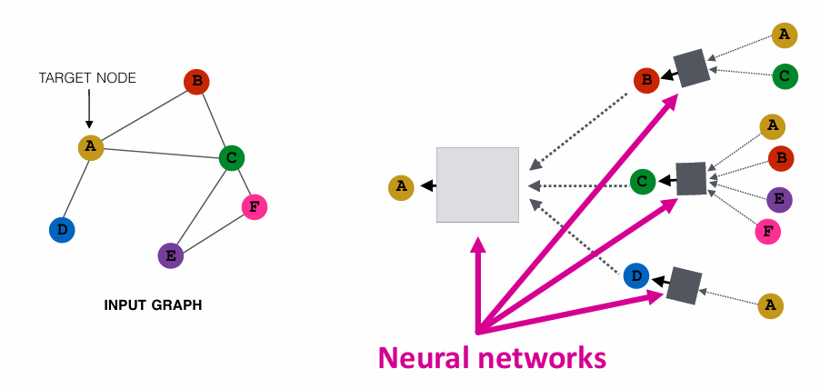
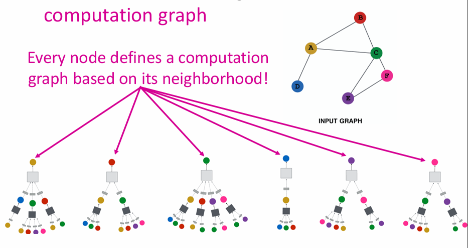
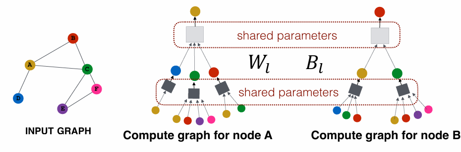
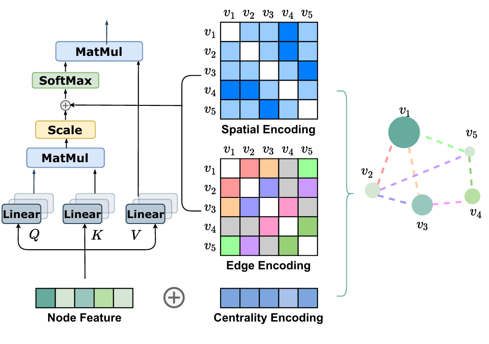

# Graphormer---CSE-471---Assignment

## Introduction
Transformers have transformed fields like NLP and computer vision, but they’ve struggled to match Graph Neural Networks (GNNs) on graph representation benchmarks. This raises a key question: Are Transformers unsuitable for graph data, or is there a better way to use them?

The paper *Graphormer* answers this by introducing methods to effectively encode graph structure into Transformers, enabling state-of-the-art performance on graph tasks. Key innovations include:

- **Centrality Encoding**: Captures node importance using degree centrality.
- **Spatial Encoding**: Encodes relationships between nodes using shortest path distances.
- **Edge Encoding**: Incorporates edge-specific features like bond types in molecular graphs.

With these enhancements, Graphormer bridges the gap between GNNs and Transformers, achieving exceptional results on tasks like molecular property prediction and large-scale challenges (e.g., OGB-LSC). 

This blog explores how Graphormer works, the challenges it addresses, and its potential to reshape graph representation learning.

---

## Message Passing and Aggregation in Graph Neural Networks (GNNs)
GNNs are powerful tools for learning from graph-structured data. They rely on **message passing and aggregation** to propagate information through the graph. Here’s an overview:

### 1. Understanding Graphs
A graph comprises nodes (entities) and edges (relationships). Nodes and edges may have features that add context, such as user attributes in social networks or bond types in molecules.

### 2. Message Passing
Message passing is the core operation in GNNs. Each node \(i\) gathers information from its neighbors:

- **Message Generation**: Neighbors send their features to \(i\).  
- **Message Aggregation**: Node \(i\) combines the received messages.



Mathematically:
```math
h_i^{(l+1)} = \text{Aggregate} \big( \{ f(h_i^{(l)}, h_j^{(l)}, e_{ij}) \, | \, j \in \mathcal{N}(i) \} \big)
```
### Where:
- $h_i^{(l)}$: Feature of node $i$ at layer $l$.  
- $e_{ij}$: Feature of the edge between $i$ and $j$.  
- $\mathcal{N}(i)$: Set of neighbors of $i$.  
- $f$: Function to compute messages.  
- **Aggregate**: Combines messages (e.g., sum, average).  

---



### 3. Aggregation
Nodes aggregate messages to update their features, capturing both local structure and context. Common methods include summing, averaging, or using attention mechanisms.

---

### 4. Stacking Layers
By stacking multiple layers, GNNs allow nodes to gather information from farther graph regions, enabling multi-hop relationships.

---

### 5. Challenges of GNNs
Despite their success, GNNs face limitations:
- **Over-smoothing**: Node features become indistinguishable with deeper layers.  
- **Local Focus**: Struggle to capture global graph properties.  
- **Scalability**: Computationally expensive for large graphs.  

---

### Why Graphormer?  
While GNNs excel at local structure, their global modeling is limited. Graphormer overcomes these challenges by integrating graph structure directly into the Transformer architecture, blending the strengths of both approaches.

Next, we’ll explore how Graphormer achieves this!


# Transformer and Graphormer: A Comprehensive Overview

## Transformer Architecture
The Transformer architecture is a composition of Transformer layers. Each layer consists of:

 

1. **Self-Attention Module**  
   - Inputs: $H = [h_1, h_2, \dots, h_n] \in \mathbb{R}^{n \times d}$, where $d$ is the hidden dimension.  
   - Computations:  
     - $Q = HW_Q, \; K = HW_K, \; V = HW_V$  
     - $A = \frac{QK^T}{\sqrt{d_K}}$  
     - $\text{Attn}(H) = \text{softmax}(A)V$  
   - $A$: Captures similarity between queries and keys.

2. **Feed-Forward Network (FFN)**  
   - Position-wise, applied to each token individually.

### Multi-Head Attention
For simplicity, the above description considers single-head attention. In practice, multi-head attention splits $Q, K, V$ across multiple heads for richer representation learning.

---

## Graphormer Overview
Graphormer is designed for graph tasks, leveraging graph structure within the Transformer framework. It addresses key challenges of GNNs by integrating graph-specific inductive biases.

### Key Features of Graphormer
1. **Structural Encodings**  
   To incorporate graph structure into Transformer models, Graphormer introduces three encoding strategies:
   - **Centrality Encoding**
   - **Spatial Encoding**
   - **Edge Encoding**

2. **Implementation Enhancements**  
   Graphormer adopts modifications like pre-Layer Normalization for better optimization.

3. **Special Node**  
   Introduces a special node, [VNode], for aggregating graph-level representations.

---

## Structural Encodings in Graphormer

### Centrality Encoding
- **Purpose:** Incorporates node importance into attention calculations.  
- **Method:**  
  - Use degree centrality (indegree and outdegree).  
  - Add learnable embedding vectors $z_{deg}$ and $z_{deg+}$ based on node degree:  
    
    $h_i^{(0)} = x_i + z_{deg}(\text{deg}(v_i)) + z_{deg+}(\text{deg}^+(v_i))$
      
  - Effective for undirected graphs by unifying indegree and outdegree into a single degree value.

---

### Spatial Encoding
- **Purpose:** Captures positional dependency in graphs.  
- **Method:**  
  - Define a spatial relation function $\phi(v_i, v_j)$, using shortest path distance (SPD).  
  - Incorporate spatial bias $b(\phi(v_i, v_j))$ into attention:  
    
    $A_{ij} = \frac{(h_i W_Q)(h_j W_K)^T}{\sqrt{d}} + b(\phi(v_i, v_j))$
     
- **Benefits:**  
  - Enables global receptive field in a single Transformer layer.  
  - Adapts attention based on graph structure.

---

### Edge Encoding
- **Purpose:** Incorporates edge features into attention layers.  
- **Method:**  
  - For node pair $(v_i, v_j)$, compute edge bias $c_{ij}$ using shortest path $SP_{ij}$:  
    
    $c_{ij} = \frac{1}{N} \sum_{n=1}^{N} x_{e_n} (w_E^n)^T$
     
  - Update attention score:  
    
    $A_{ij} = \frac{(h_i W_Q)(h_j W_K)^T}{\sqrt{d}} + b(\phi(v_i, v_j)) + c_{ij}$
    

---

## Graphormer Implementation Details

### Graphormer Layer
- Built upon the classic Transformer encoder with modifications:  
  - **Pre-Layer Normalization:** Applied before MHA and FFN.  
  - **Dimensionality:** Input, output, and inner-layer dimensions are set to $d$.  
  - Formally defined as:  
    
    $h^{(l)} = \text{MHA}(\text{LN}(h^{(l-1)})) + h^{(l-1)}$
    
    $h^{(l)} = \text{FFN}(\text{LN}(h^{(l)})) + h^{(l)}$
    

---

### Special Node: [VNode]
- **Purpose:** Represents the entire graph.  
- **Method:**  
  - Add a virtual node [VNode] connected to all other nodes.  
  - The shortest path distance is set to 1 for connections involving [VNode].  
  - Distinguish physical and virtual connections by resetting spatial encodings for [VNode].  

---

## Advantages of Graphormer
1. **Global Contextualization:** Combines global receptive fields of Transformers with local structural encodings of graphs.  
2. **Unified Framework:** Popular GNNs become special cases of Graphormer.  
3. **Effective Representation:** Captures both semantic and structural information, addressing key limitations of GNNs.  

---

## How powerful is Graphormer?
Graphormer demonstrates enhanced power compared to traditional GNNs by representing the **AGGREGATE** and **COMBINE** steps of popular models like GIN, GCN, and GraphSAGE through its spatial encoding and self-attention mechanisms. Spatial encoding allows the model to distinguish neighbor sets $N(v_i)$ and compute statistics like mean or sum over them, while multiple attention heads and FFNs enable separate and combined processing of node and neighbor representations. Furthermore, Graphormer surpasses the expressiveness of classic message-passing GNNs, which are limited by the 1-Weisfeiler-Lehman (1-WL) test, enabling it to distinguish graphs that 1-WL fails to differentiate.


## Conclusion
Graphormer bridges the gap between GNNs and Transformers, offering a powerful model for graph tasks by leveraging structural encodings and innovative design choices.


